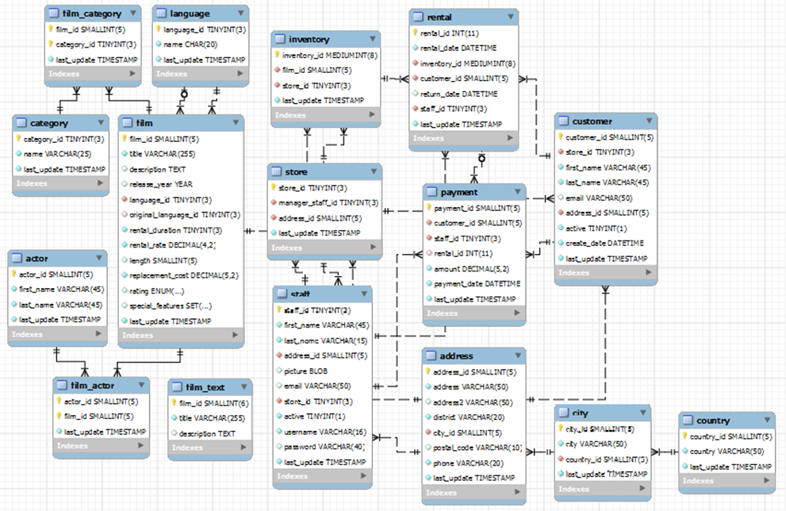

# Pensar e Responder 01

Com base no diagrama abaixo, disserte sobre Modelo Dimensional e Modelo Estrela (Kimball).​

## Modelagem Dimensional

A modelagem dimensional é uma estratégia de modelagem que consiste em simplificar modelos mais complexos com o Entidade Relacionamento Normalizado, cujo principal objetivo é evitar a redundância e ser mais performático nas operações de escrita e atualização de dados. Por isso, esse formato é amplamente utilizado para representação de dados de negócios para áreas de Business Intelligence levantarem Insights ou para os tomadores de decisões fazerem as escolhas baseados em  dados (Data Driven).

A modelagem dimensional é comumente montada a partir de uma área de staging de um data warehouse, que reflete dados transacionais que são transformados e disponibilizados como Dimensões e Fatos segundo uma modelagem muito comum desenvolvida por Ralph Kimball chamada Modelo Estrela (Star Schema).

O modelo estrela consiste em realizar a desnormalização dos dados em um nível que apenas Dimensões e Fatos sejam disponibilizados.

Nesse formato do Star Schema, as dimensões representam largas tabelas que tende a serem completas, isto é, não relacionam-se com outras informações e contém em suas colunas todas as informações e de qualquer item que em um ER Normalizado estivesse  disposto em várias colunas. Por outro lado, as tabelas fatos ou os indicadores de negócio tendem a serem cumpridas e possuírem medidas de negócio e as chaves estrangeiras das dimensões.

Kimball também aponta que outra responsabilidade importante é representar as dimensões ao longo do tempo, isto é, fazer a captura de alterações pontuais das dimensões e representá-las ao longo do tempo. Uma estratégia comumente  utilizada para isso é a um modelo de Slowly Changing Dimension (SCD).

Em resumo, Kimball define que na modelagem dimensional utilizando o conceito de Star Schema a tabela fato precisa estar na terceira forma normal e as dimensões na segunda forma normal.

## Representação do Modelo ER para Star Schema

A partir do modelagem ER disponibilizada podemos construir um modelo estrela de forma a atender os seguintes critérios:

1. Identificação do Fato de Negócio
2. Construção das Dimensões
3. Construção da Dimensão Tempo
4. Construção da Fato

### Identificação do Fato de negócio

A partir de uma análise superficial do modelo podemos inferir que o negócio trate-se de uma locadora de filmes e que uma medida de negócio pode ser, por exemplo, facilmente definida como alugueis realizados

### Construção das Dimensões

As dimensões no modelo são identificadas como as seguintes

- Dimensão Filme
- Dimensão Cliente
- Dimensão Tempo
